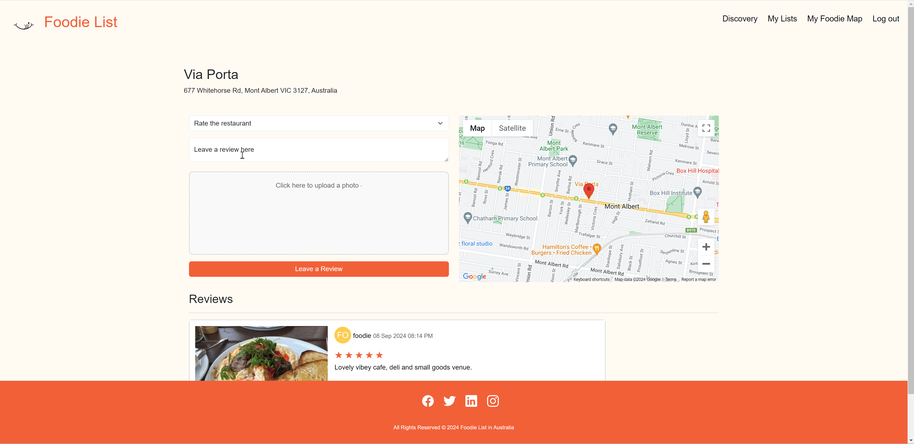

### APP Title: Foodie List

### Project background (group work):
FoodieList is designed for food lovers who enjoy discovering new restaurants and sharing their dining experiences. The platform leverages the Google Places API to help users easily find restaurant information and streamline the process of saving their favorite spots. By enabling users to curate their personal list of go-to places, FoodieList enhances the dining experience by making it simple to discover, track, and share the restaurants they love.

In the digital age, online reviews play a crucial role in shaping dining decisions. However, many reviews lack authenticity, making it difficult for users to trust them. To address this issue, FoodieList promotes transparency and authenticity by requiring users to upload a photo when posting reviews, ensuring that each review comes from a genuine dining experience.


### Overview:
- Search for Restaurants: Connects with Google Places API to locate restaurants and retrieve detailed information about each location.
- Post Authentic Reviews: Users are encouraged to provide honest feedback by posting reviews, which must include a photo to verify their dining experience.
- (UPCOMING) Save Favorite Restaurants and Foodie Map: Users can compile a personalized list of their favorite restaurants and generate an overall map for all saved restaurants for easy access. 

NOTE: Google places have specified only in AUS


### Technologies Used
Python + Django + AWS S3 + Google Places Api + Bootstrap

### Getting Started
- [Wireframes](https://www.figma.com/design/GxsF8ygOY6QuglxqYBDaF7/Foodie_list?node-id=1-2&t=xKMlIpqdJQIq5dA3-1)
- [DeploymentURL] (https://mysite-6ttg.onrender.com)


```

username: foodie
password: 9876qwer
```

### Screenshots
Search your interested restaurant and see the place detail</br>

Create your review for the restaurant with image</br>

Warining when leave review without an image or not in JPEG/PNG format</br>

Edit or delete your review</br>


### Next Steps
1. Upload multiple photos and delete photo when doing review, edit review photo
2. Save favorite restaurants to my list
3. Show saved restaurants on my Foodie map


